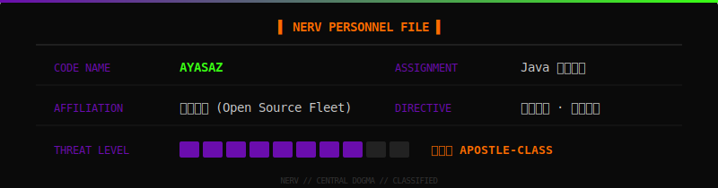
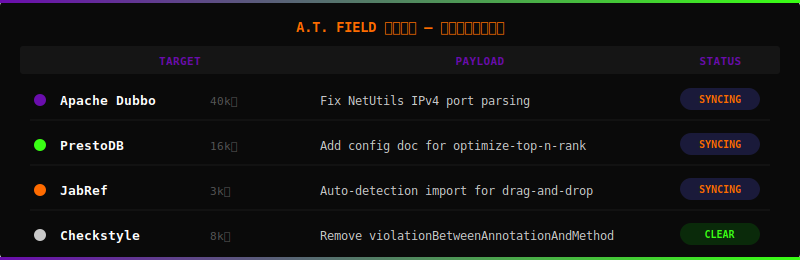
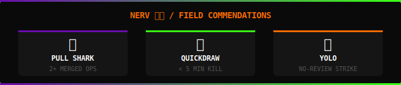

<!-- ╔══════════════════════════════════════════════════════════════╗ -->
<!--                   NERV // CENTRAL DOGMA TERMINAL                  -->
<!-- ╚══════════════════════════════════════════════════════════════╝ -->

<!-- ── 警告条纹 ── -->

`MAGI: MELCHIOR-1` · `BALTHASAR-2` · `CASPER-3` &nbsp;|&nbsp; **STATUS:** 🟢 ACTIVE &nbsp;|&nbsp; **PILOT:** Java Backend Engineer

---

### ⬡ E.V.A. UNIT — 装备系统 / EQUIPMENT MANIFEST ⬡

<!-- EVA 初号机配色：紫 / 绿 / 橙 -->

---

### ⚠ MAGI SYSTEM — 同步率诊断 / SYNC DIAGNOSTICS ⚠

 

 

---

---

---

> ### 「 逃げちゃダメだ、逃げちゃダメだ、逃げちゃダメだ。」
> #### *— 不能逃避。不能逃避。不能逃避。 —*

📡 **同步通讯频道 / CONTACT NERV HQ:** <a href="https://github.com/Ayasaz">GitHub Terminal ▸</a>

 

